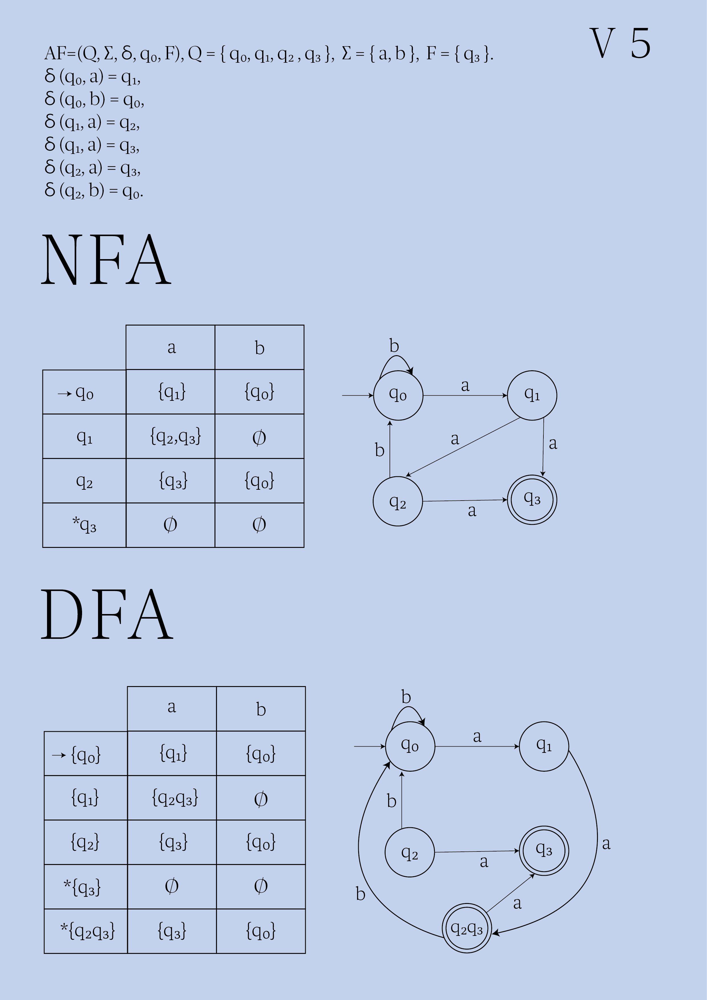

# Conversion of Nondeterministic Finite Automato to Deterministic Finite Automato
## Variant 5

## Tasks:

1. Convert NFA from your variant to DFA on paper, writing all transitions and drawing converted automato.

