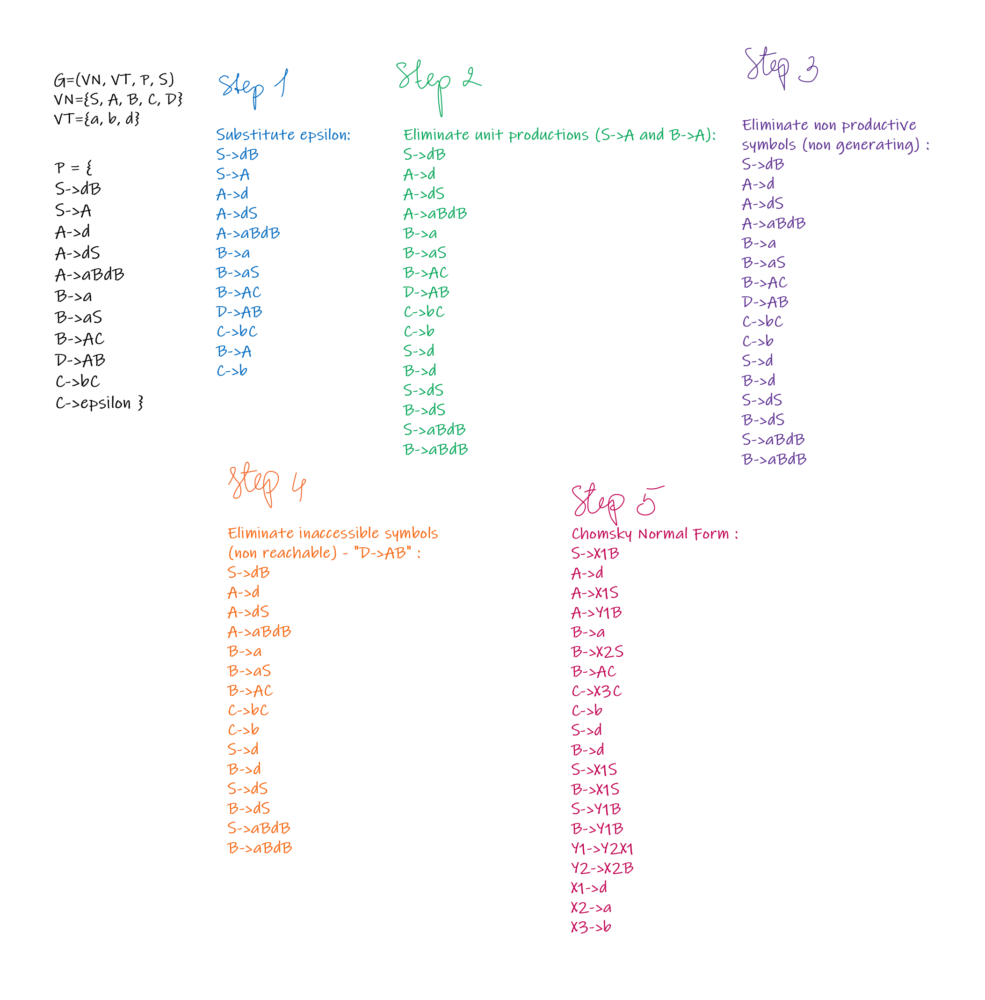

# Chomsky Normal Form

## Variant 5

## Tasks:

- Eliminate ε productions.
- Eliminate any renaming.
- Eliminate inaccessible symbols.
- Eliminate the non productive symbols.
- Obtain the Chomsky Normal Form.

```
G = (V_N, V_T, P, S) V_N = {S, A, B, C, D} V_T = {a, b, d}
P = {
    1. S -> dB     5. A -> aBdB    9. D -> AB
    2. S -> A      6. B -> a       10. C -> bC 
    3. A -> d      7. B -> aS      11. C -> ε 
    4. A -> dS     8. B -> AC                
}
```

## Solution:
